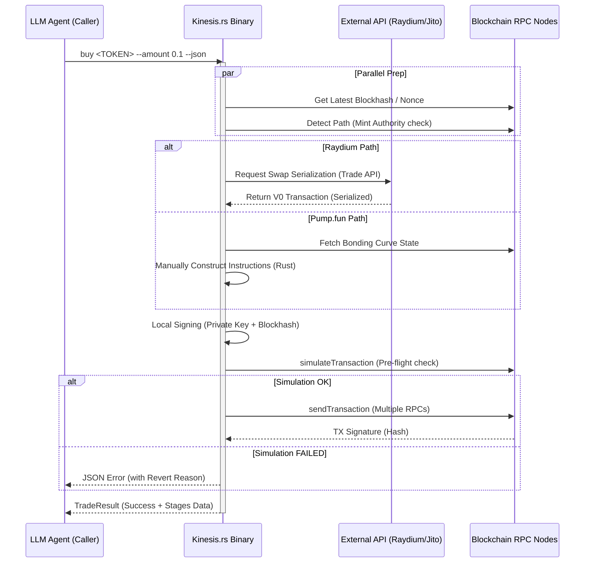

# Kinesis.rs Architecture

## 1. Design Philosophy: Agent-First Execution
Kinesis.rs is not a wallet; it is a **highly optimized execution kernel** designed to be the "hands" of an AI Agent. 

### Key Principles:
- **Zero-Trust**: Private keys never leave the binary process.
- **Deterministic Output**: Every action returns a structured JSON `TradeResult` with millisecond-level timing data for each stage.
- **Resilience**: Fail-fast logic with automatic fallback to secondary RPCs or routing paths.

## 2. Core Components

```text
+-------------------------------------------------------------+
|                      LLM Agent (Caller)                     |
|           (Gemini CLI, Claude Code, OpenClaw)               |
+------------------------------+------------------------------+
                               |
                               v
+------------------------------+------------------------------+
|                        Kinesis.rs CLI                       |
|      (Input Validation, Env Loading, JSON Serialization)    |
+-------+----------------------+-----------------------+------+
        |                      |                       |
        v                      v                       v
+-------+-------+      +-------+-------+       +-------+------+
|   Path        |      |   Parallel    |       |   Security   |
|   Detector    |      |   Data Fetch  |       |   Signer     |
| (Mint/Owner)  |      | (Hash/Nonce)  |       | (Enc Isolation)|
+-------+-------+      +-------+-------+       +-------+------+
        |                      |                       |
        +-----------+----------+-----------+-----------+
                    |
                    v
+-------------------+-----------------------------------------+
|                  Multi-Chain Execution Engine               |
|   +--------------------------+   +----------------------+   |
|   |      Solana Driver       |   |      BSC Driver      |   |
|   | (Pump.fun / Raydium V3)  |   | (Multi-RPC Racing)   |   |
|   +--------------------------+   +----------------------+   |
+-------------------+-----------------------------------------+
                    |
                    v
+-------------------+-----------------------------------------+
|                On-Chain Networks (Mainnet)                  |
|         (Solana, BSC, Jito Block Engine, DEXs)              |
+-------------------------------------------------------------+
```

The detector automatically classifies tokens into three execution paths:
1. **Pump.fun**: Native bonding curve logic (manual instruction construction).
2. **Raydium V3**: Standard AMM/CLMM paths via Raydium Trade API.
3. **Token-2022**: Advanced support for the new Solana token standard.

### 2.2 The Multi-RPC Engine (BSC)
For BSC, Kinesis implements an **"RPC Racing"** strategy. It broadcasts transactions to multiple providers simultaneously and waits for the first success, effectively bypassing individual node congestion or rate limits.

### 2.3 Optimization Layer
- **Tokio Parallelism**: Fetching `Blockhash` (Solana) or `Nonce/Gas` (BSC) happens in parallel with quote calculations.
- **Template Pre-construction**: Transaction structures are prepared before the final quote is received to shave off precious milliseconds.

## 3. Execution Lifecycle (Sequence Diagram)



## 4. Performance Audit Data
Kinesis provides a `stages` array in every output, enabling Agents to audit execution performance:
- `cli_parse`: Argument processing.
- `executor_init`: Provider & Signer setup.
- `quote`: Time spent on price discovery.
- `simulate_execution`: Pre-flight latency.
- `send_transaction`: Broadcast latency.
