# Kinesis.rs Rust v1.0 Project Architecture

**Document Version**: 1.0  
**Last Updated**: 2026-03-11  
**Architecture Style**: Alibaba Layered Architecture

---

## 1. System Overview

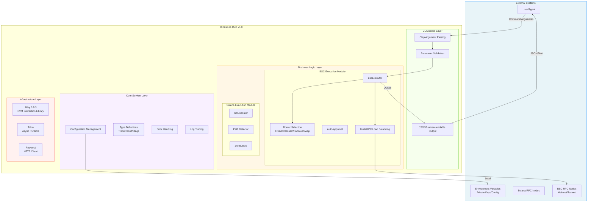

---

## 2. Layered Architecture Details

```mermaid
flowchart LR
    subgraph L1["Layer 1: Access Layer"]
        A1[CLI Argument Parsing<br/>clap]
        A2[Env Variable Loading<br/>dotenvy]
        A3[Output Formatting<br/>serde_json]
    end

    subgraph L2["Layer 2: Business Layer"]
        B1[BSC Trade Execution<br/>buy/sell/quote]
        B2[Allowance Management<br/>approve/approveIfNeeded]
        B3[Balance Inquiry<br/>balance]
        B4[Multi-wallet Management<br/>wallet selector]
    end

    subgraph L3["Layer 3: Domain Layer"]
        D1[TradeResult<br/>Execution Results]
        D2[Stage<br/>Execution Phases]
        D3[TradeError<br/>Error Types]
        D4[Chain<br/>Chain Enumeration]
    end

    subgraph L4["Layer 4: Infrastructure Layer"]
        I1[Alloy 0.8.3<br/>Blockchain Interaction]
        I2[Tokio<br/>Async Runtime]
        I3[Reqwest<br/>HTTP Client]
        I4[tracing<br/>Structured Logging]
    end

    L1 --> L2
    L2 --> L3
    L3 --> L4
    
    classDef l1 fill:#e6f7ff,stroke:#1890ff
    classDef l2 fill:#f6ffed,stroke:#52c41a
    classDef l3 fill:#fff7e6,stroke:#fa8c16
    classDef l4 fill:#f9f0ff,stroke:#722ed1
    
    class L1 l1
    class L2 l2
    class L3 l3
    class L4 l4
```

---

## 3. Module Dependencies

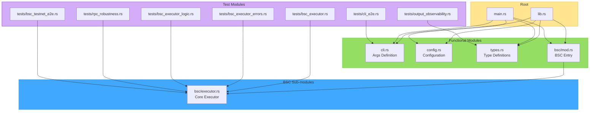

---

## 4. BscExecutor Internal Architecture

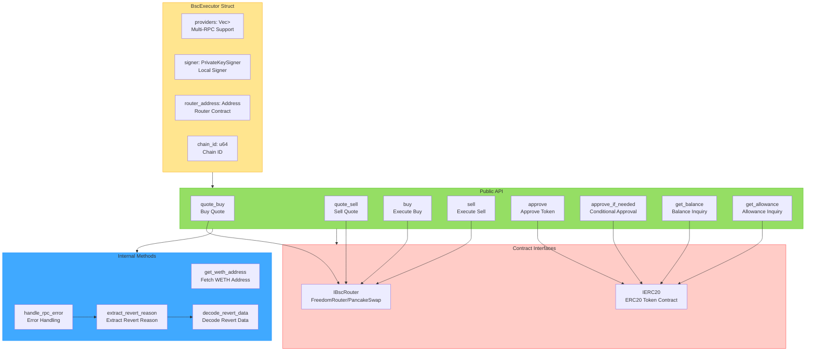

---

## 5. Trade Execution Sequence

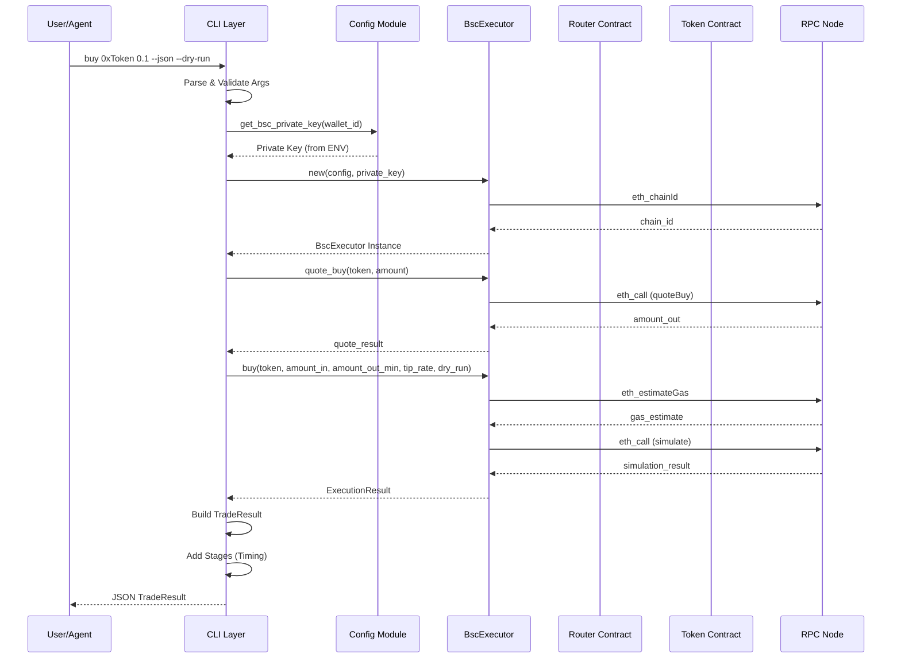

---

## 6. Sell Flow (with Auto-Approval)

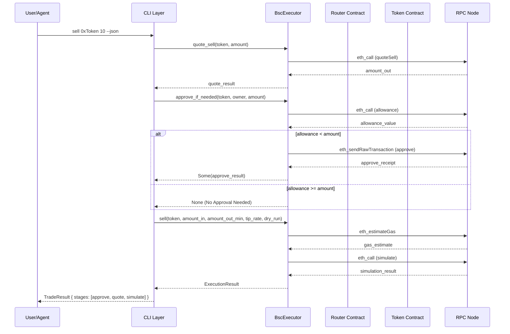

---

## 7. Error Handling Architecture

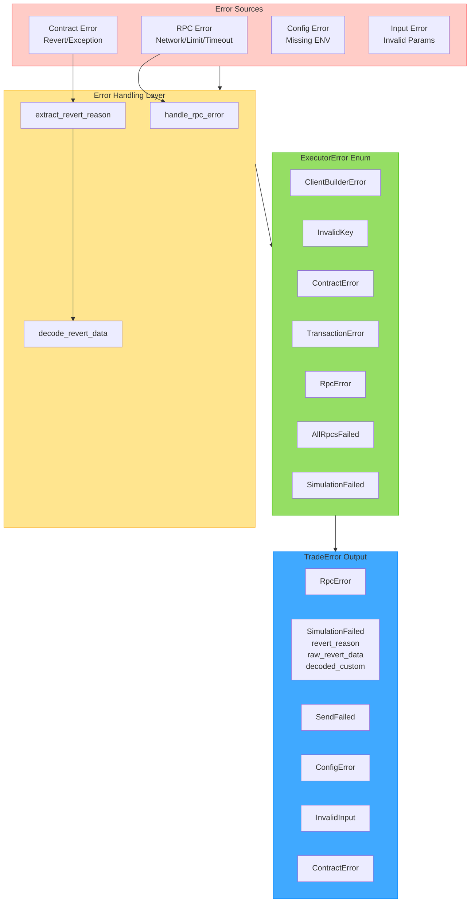

---

## 8. Revert Reason Decoding Flow

```mermaid
flowchart LR
    subgraph Input["Error Input"]
        ERR[RPC Error Message<br/>"execution reverted: ..."]
    end

    subgraph Extract["Extraction Phase"]
        E1[Find "execution reverted:"]
        E2[Extract Reason String]
        E3[Detect 0x Prefix]
    end

    subgraph Decode["Decoding Phase"]
        D1{0x Prefix?}
        D2[Return String Directly]
        D3[Hex Decode]
        D4{First 4 Bytes Selector}
    end

    subgraph Output["Output Types"]
        O1[Error string<br/>08c379a0]
        O2[Panic uint256<br/>4e487b71]
        O3[Custom Error<br/>Other Selector]
        O4[REVERT_NO_DATA]
    end

    Input --> E1
    E1 --> E2
    E2 --> E3
    E3 --> D1
    D1 -->|No| D2
    D1 -->|Yes| D3
    D3 --> D4
    D4 -->|08c379a0| O1
    D4 -->|4e487b71| O2
    D4 -->|Other| O3
    
    classDef input fill:#ffccc7,stroke:#ff4d4f
    classDef extract fill:#ffe58f,stroke:#faad14
    classDef decode fill:#95de64,stroke:#52c41a
    classDef output fill:#40a9ff,stroke:#1890ff
    
    class Input input
    class Extract extract
    class Decode decode
    class Output output
```

---

## 9. Data Model Architecture

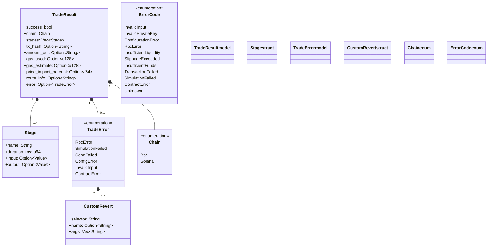

---

## 10. CLI Command Architecture

```mermaid
flowchart TB
    subgraph GlobalFlags["Global Flags"]
        G1[--json<br/>JSON Output Mode]
        G2[--dry-run<br/>Simulation Mode (Default)]
        G3[--wallet N<br/>Wallet Selection]
    end

    subgraph Commands["Commands"]
        C1[buy<br/>Execute Buy]
        C2[sell<br/>Execute Sell]
        C3[quote<br/>Price Quote]
        C4[balance<br/>Balance Inquiry]
        C5[approve<br/>Token Approval]
        C6[config<br/>Show Config]
        C7[wallet<br/>Show Addresses]
    end

    subgraph BuyArgs["buy Arguments"]
        B1[token_address: String]
        B2[amount: f64]
        B3[--chain: Chain]
        B4[--slippage: f32 0-100]
        B5[--tip_rate: f32 0-5]
    end

    subgraph SellArgs["sell Arguments"]
        S1[token_address: String]
        S2[amount: f64]
        S3[--chain: Chain]
        S4[--slippage: f32 0-100]
        S5[--tip_rate: f32 0-5]
    end

    subgraph QuoteArgs["quote Arguments"]
        Q1[token_address: String]
        Q2[amount: f64]
        Q3[--action: buy/sell]
        Q4[--chain: Chain]
    end

    GlobalFlags --> Commands
    C1 --> BuyArgs
    C2 --> SellArgs
    C3 --> QuoteArgs
    
    classDef global fill:#ffe58f,stroke:#faad14
    classDef cmd fill:#95de64,stroke:#52c41a
    classDef args fill:#40a9ff,stroke:#1890ff
    
    class GlobalFlags global
    class Commands cmd
    class BuyArgs args
    class SellArgs args
    class QuoteArgs args
```

---

## 11. Configuration Management

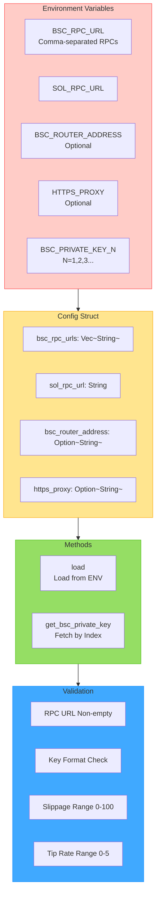

---

## 12. Test Architecture

```mermaid
flowchart TB
    subgraph UnitTests["Unit Tests"]
        U1[main.rs::tests<br/>Clap Logic]
    end

    subgraph IntegrationTests["Integration Tests"]
        I1[bsc_executor.rs<br/>Quote/Approve/Balance/Sim]
        I2[bsc_executor_errors.rs<br/>Error Handling]
        I3[bsc_executor_logic.rs<br/>Tip Encoding]
        I4[cli_e2e.rs<br/>CLI Command Flow]
        I5[output_observability.rs<br/>Output Validation]
        I6[rpc_robustness.rs<br/>Multi-RPC Reliability]
    end

    subgraph E2ETests["E2E Tests"]
        E1[bsc_testnet_e2e.rs<br/>Real Network (Ignored)]
    end

    subgraph Coverage["Coverage Metrics"]
        C1[CLI Parsing: 90%]
        C2[BSC Execution: 73%]
        C3[Observability: 100%]
        C4[RPC Robustness: 75%]
        C5[Unit Tests: 100%]
        C6[Total: 88.6%]
    end

    UnitTests --> Coverage
    IntegrationTests --> Coverage
    E2ETests --> Coverage
    
    classDef unit fill:#ffe58f,stroke:#faad14
    classDef integration fill:#95de64,stroke:#52c41a
    classDef e2e fill:#40a9ff,stroke:#1890ff
    classDef cov fill:#f9f0ff,stroke:#722ed1
    
    class UnitTests unit
    class IntegrationTests integration
    class E2ETests e2e
    class Coverage cov
```

---

## 13. Dependency Architecture

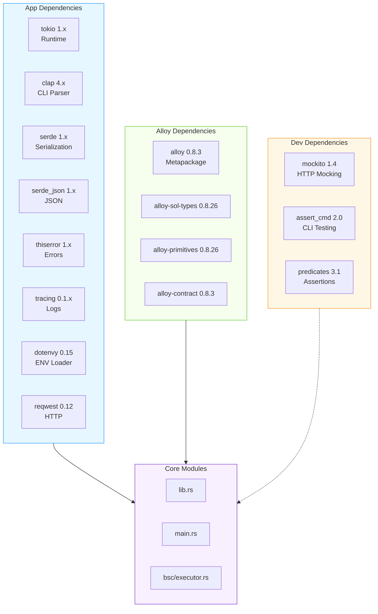

---

## 14. Deployment Architecture

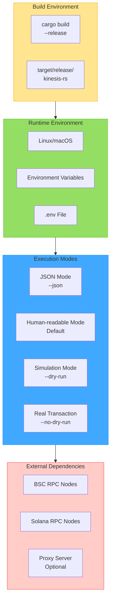

---

**Document Status**: Finalized  
**Audit Status**: Approved  
**Related Docs**: `Cargo.toml`, `src/`
