# FreedomAgent Rust v1.0 项目架构图

**文档版本**: 1.0  
**最后更新**: 2026-03-11  
**架构风格**: 阿里巴巴分层架构

---

## 1. 系统整体架构概览

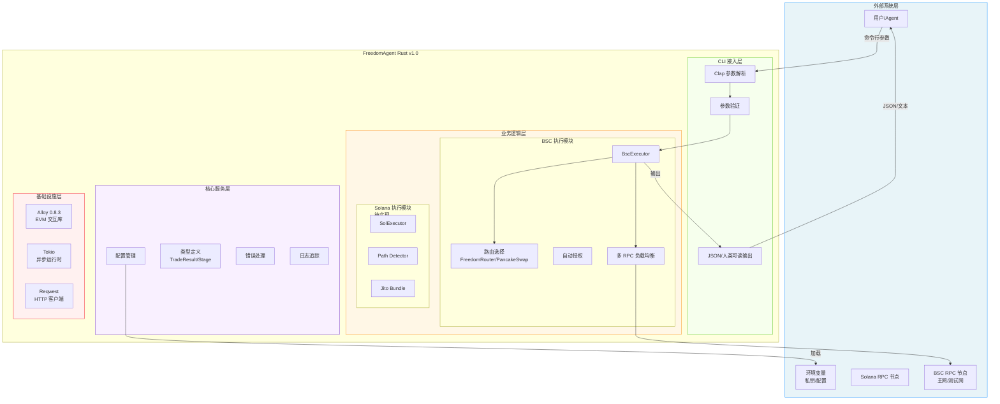

---

## 2. 分层架构详解

```mermaid
flowchart LR
    subgraph L1["第一层：接入层 (Access Layer)"]
        A1[CLI 参数解析<br/>clap]
        A2[环境变量加载<br/>dotenvy]
        A3[输出格式化<br/>serde_json]
    end

    subgraph L2["第二层：业务层 (Business Layer)"]
        B1[BSC 交易执行<br/>buy/sell/quote]
        B2[授权管理<br/>approve/approveIfNeeded]
        B3[余额查询<br/>balance]
        B4[多钱包管理<br/>wallet selector]
    end

    subgraph L3["第三层：领域层 (Domain Layer)"]
        D1[TradeResult<br/>交易结果]
        D2[Stage<br/>执行阶段]
        D3[TradeError<br/>错误类型]
        D4[Chain<br/>链枚举]
    end

    subgraph L4["第四层：基础设施层 (Infrastructure Layer)"]
        I1[Alloy 0.8.3<br/>区块链交互]
        I2[Tokio<br/>异步运行时]
        I3[Reqwest<br/>HTTP 客户端]
        I4[tracing<br/>日志追踪]
    end

    L1 --> L2
    L2 --> L3
    L3 --> L4
    
    classDef l1 fill:#e6f7ff,stroke:#1890ff
    classDef l2 fill:#f6ffed,stroke:#52c41a
    classDef l3 fill:#fff7e6,stroke:#fa8c16
    classDef l4 fill:#f9f0ff,stroke:#722ed1
    
    class L1 l1
    class L2 l2
    class L3 l3
    class L4 l4
```

---

## 3. 模块依赖关系图

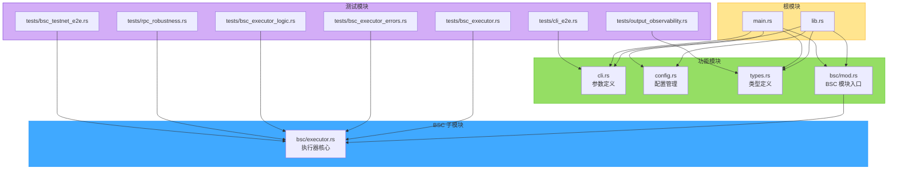

---

## 4. BSC 执行器内部架构

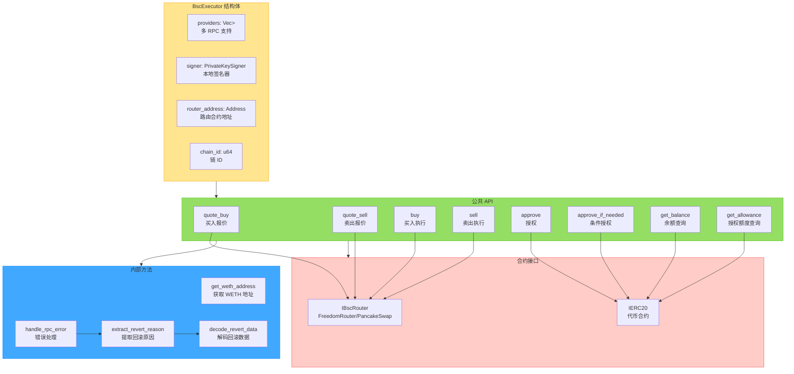

---

## 5. 交易执行流程时序图

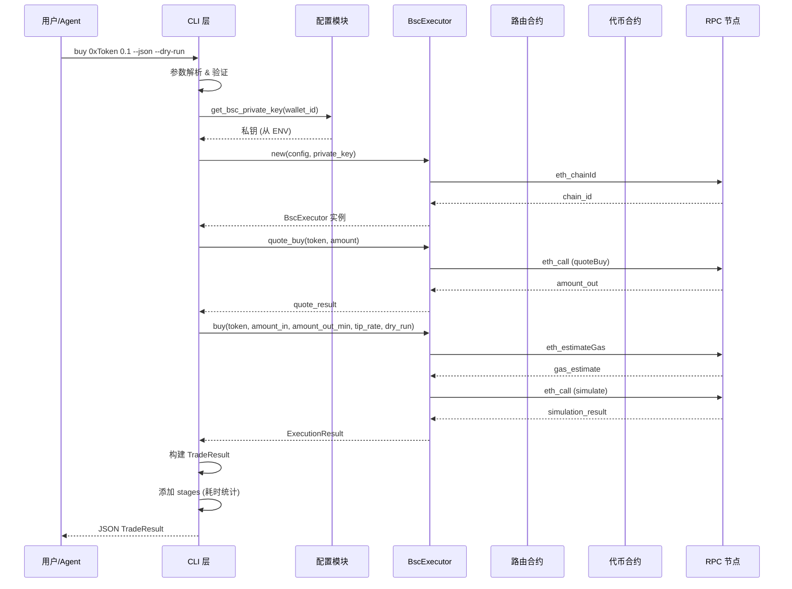

---

## 6. 卖出交易流程 (含自动授权)

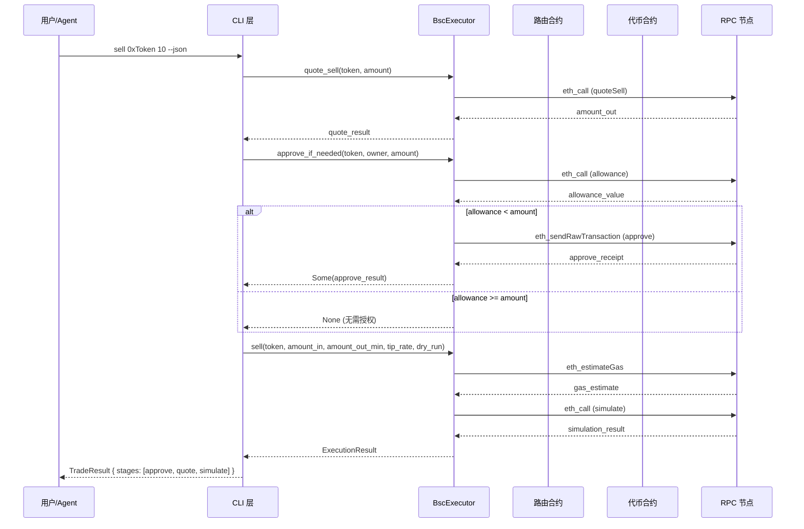

---

## 7. 错误处理架构

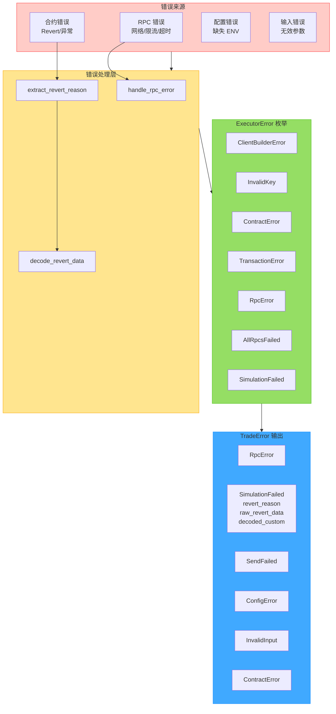

---

## 8. Revert Reason 解码流程

```mermaid
flowchart LR
    subgraph Input["错误输入"]
        ERR[RPC 错误消息<br/>"execution reverted: ..."]
    end

    subgraph Extract["提取阶段"]
        E1[查找"execution reverted:"]
        E2[提取原因字符串]
        E3[检测 0x 前缀]
    end

    subgraph Decode["解码阶段"]
        D1{是否有 0x 前缀？}
        D2[直接返回原因字符串]
        D3[hex 解码]
        D4{前 4 字节 selector}
    end

    subgraph Output["输出类型"]
        O1[Error string<br/>08c379a0]
        O2[Panic uint256<br/>4e487b71]
        O3[Custom Error<br/>其他 selector]
        O4[REVERT_NO_DATA]
    end

    Input --> E1
    E1 --> E2
    E2 --> E3
    E3 --> D1
    D1 -->|否 | D2
    D1 -->|是 | D3
    D3 --> D4
    D4 -->|08c379a0| O1
    D4 -->|4e487b71| O2
    D4 -->|其他 | O3
    
    classDef input fill:#ffccc7,stroke:#ff4d4f
    classDef extract fill:#ffe58f,stroke:#faad14
    classDef decode fill:#95de64,stroke:#52c41a
    classDef output fill:#40a9ff,stroke:#1890ff
    
    class Input input
    class Extract extract
    class Decode decode
    class Output output
```

---

## 9. 数据模型架构


---

## 10. CLI 命令架构

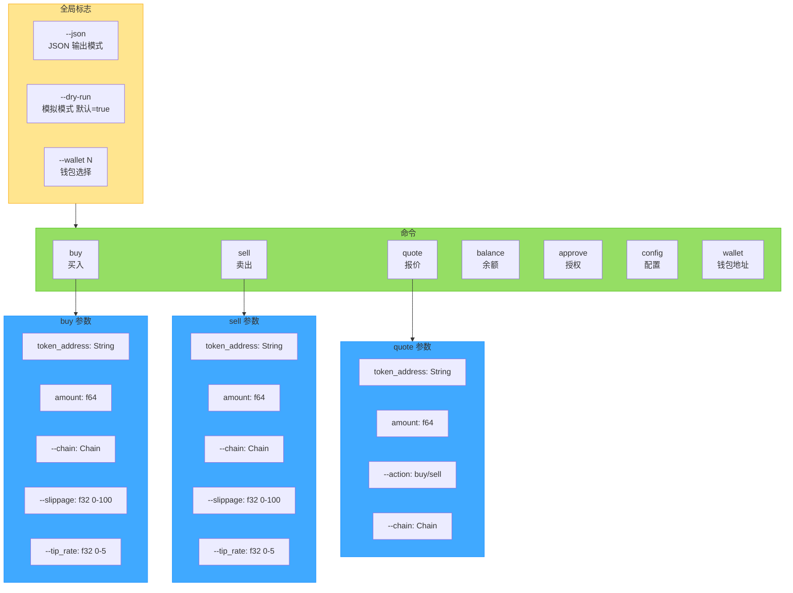

---

## 11. 配置管理架构

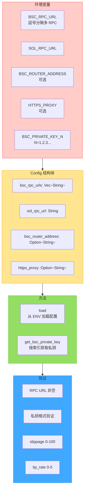

---

## 12. 测试架构

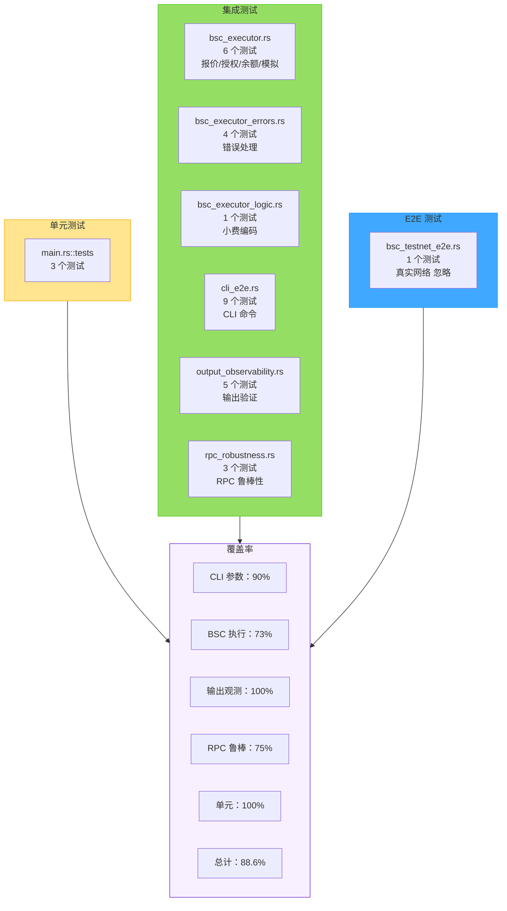

---

## 13. 依赖关系架构

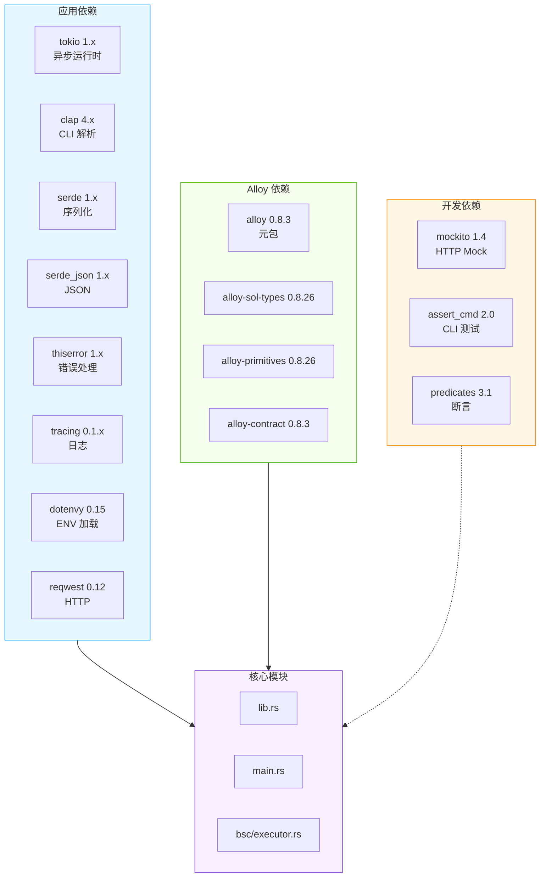

---

## 14. 部署架构

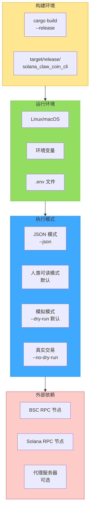

---

## 附录：架构图例说明

| 颜色 | 含义 |
|------|------|
| 🔵 蓝色 | 核心业务模块 |
| 🟢 绿色 | 业务逻辑/功能模块 |
| 🟡 黄色 | 配置/结构体 |
| 🔴 红色 | 外部系统/错误 |
| 🟣 紫色 | 核心服务/类型 |

---

**文档状态**: 已完成  
**审核状态**: 待审核  
**关联文档**: `Cargo.toml`, `src/`, `docs/alloy-dependency.md`
